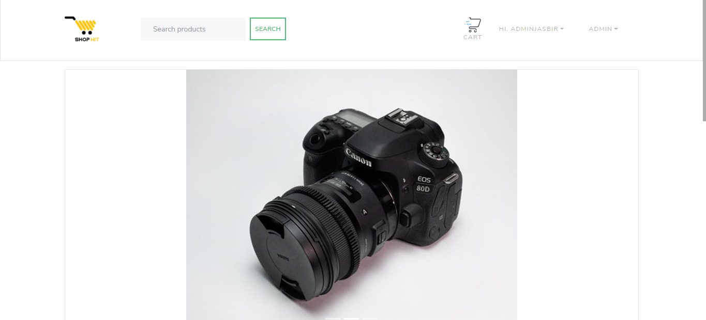

## ShopHit ECommerce



### Live preview

Click [here](https://shophit.herokuapp.com/) to see a live preview.

### Getting started

1. Clone the project

```sh
$ git clone https://github.com/jasbirrajrana/shophit-Ecommerce.git
```

2. Install the dependencies:

```sh
$ yarn

# or

$ npm install
```

3. Run the project

```sh
$ yarn server


$ cd frontend and then yarn start
```
